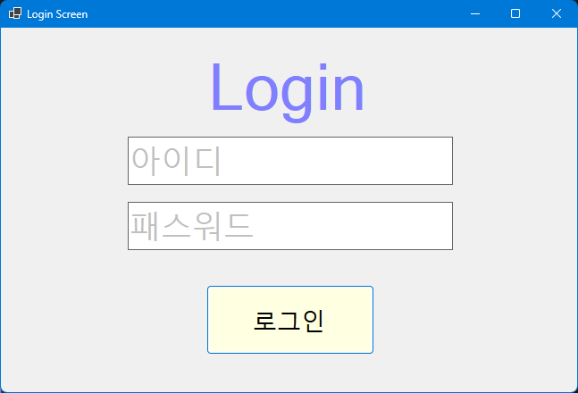
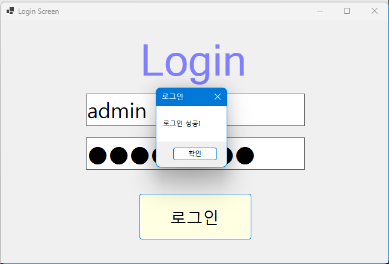
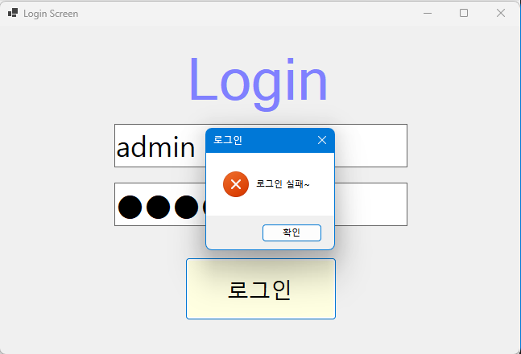
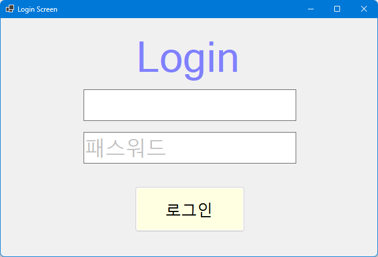
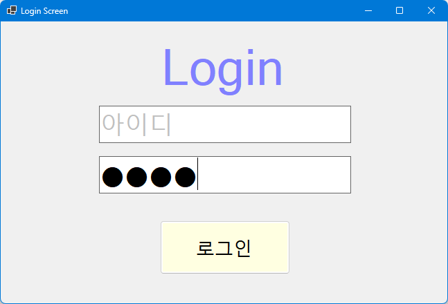
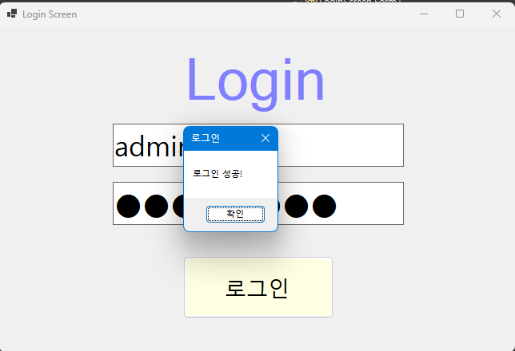
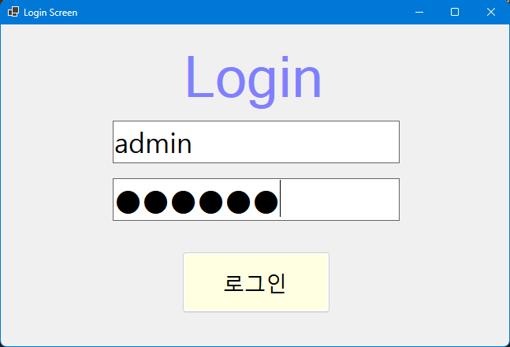
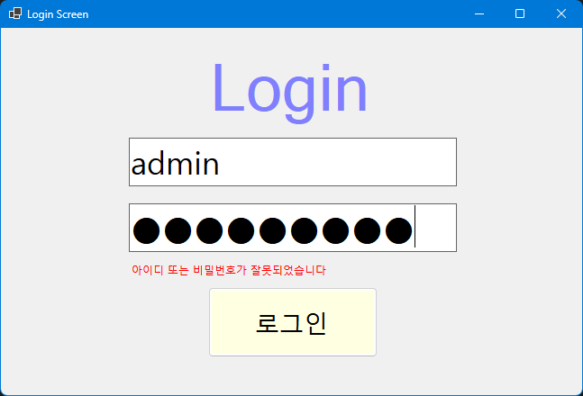
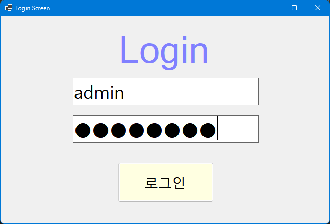
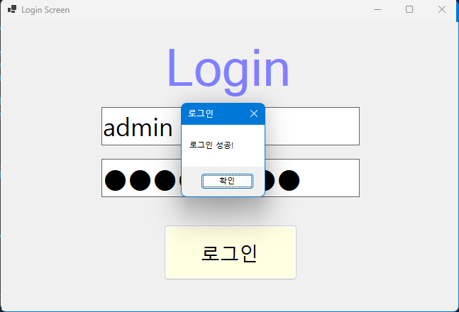

# (C# 코딩) 로그인
## 개요
- C# 프로그래밍 학습
  - 1줄 소개: 사용자 키보드 입력을 받아서 처리하는 프로그램
- 사용한 플랫폼: 
  - C#, .NET Windows Forms, Visual Studio, GitHub
- 사용한 컨트롤:
  - Label, TextBox, ListBox, Button
- 사용한 기술과 구현한 기능:
  - 사용자 입력 처리: TextBox 컨트롤을 사용하여 사용자로부터 입력을 받고, Button 클릭 이벤트를 통해 입력된 데이터를 처리
  - 패스워드가 틀렸을 때 에러 메세지를 로그인 창에 표시

-핵심기능
  -사용자로부터 아이디와 패스워드를 입력받아 로그인 처리

-화면구성
  -로그인라벨, 아이디/패스워드 입력 텍스트박스, 로그인버튼

## 실행 화면 (과제1)
- 1단계 코드의 실행 스크린샷
- 
- 초기화면
- 
- 
- 로그인 성공과 실패 화면
- 
- 
- 텍스트박스를 클릭하거나 포커스를 맞추면 아이디, 패스워드의 회색 글자가 사라지는 기능
- 문자 입력 없이 다른 텍스트 박스로 이동하면 다시 회색 글자가 나타나는 기능
- 패스워드 입력 시 *표시로 문자를 가리는 기능
- 
- 엔터키로 로그인 버튼 클릭 기능

## 실행 화면 (과제2)
- 2단계 코드의 실행 스크린샷
- 
- 
- 로그인 실패 시 실패 텍스트 표시
- 
- 
- 로그인 성공 시 실패 텍스트 숨김

## 배운 내용

